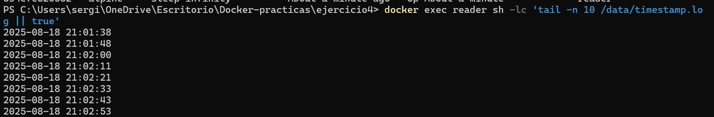
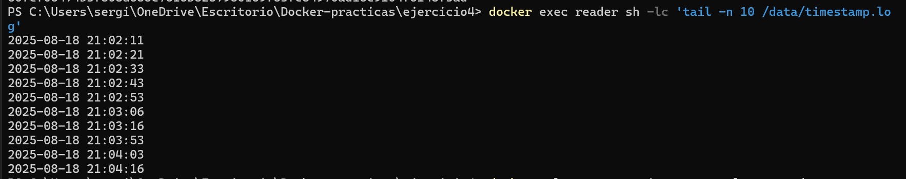
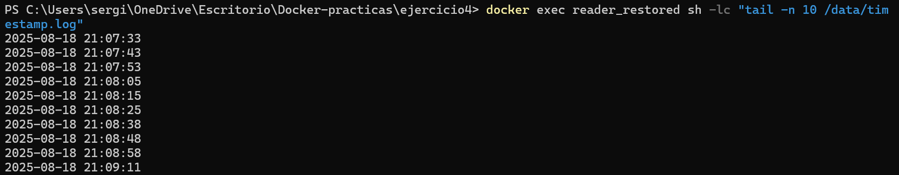

# Ejercicio 4: Persistencia y Compartición de Datos (Docker CLI)

> **Objetivo:** usar volúmenes para que los datos persistan entre reinicios/borrados de contenedores y poder hacer **backup** y **restore** sin detenerlos.


## 0) Crear el volumen

```bash
# Linux/macOS/Git Bash *o* Windows PowerShell
docker volume create timestamps_vol
```

Verifica:

```bash
docker volume ls | grep timestamps_vol
```

---

## 1) Contenedor `writer`

Escribe la fecha cada 10 s en `/data/timestamp.log` y se reinicia solo si Docker reinicia.

```bash
# Linux/macOS/Git Bash
docker run -d \
  --name writer \
  --restart unless-stopped \
  -v timestamps_vol:/data \
  alpine sh -c 'while true; do date "+%F %T" >> /data/timestamp.log; sync; sleep 10; done'
```

```powershell
# Windows PowerShell (misma lógica; comillas dobles fuera, simples dentro)
docker run -d --name writer --restart unless-stopped -v timestamps_vol:/data alpine sh -c "while true; do date '+%F %T' >> /data/timestamp.log; sync; sleep 10; done"
```

Comprobar que está vivo:

```bash
docker ps --filter name=writer
```

---

## 2) Contenedor `reader`

Contenedor ligero que se queda en espera. Tú lees el archivo con `docker exec` cuando quieras.

```bash
# Linux/macOS/Git Bash
docker run -d --name reader -v timestamps_vol:/data alpine sleep infinity
```

```powershell
# Windows PowerShell
docker run -d --name reader -v timestamps_vol:/data alpine sleep infinity
```

**Leer el archivo** (últimas 10 líneas):

```bash
# En ambos shells
docker exec reader sh -lc 'tail -n 10 /data/timestamp.log || true'
```

> **Tip:** para ver cómo crece en tiempo real:

```bash
# Linux/macOS/Git Bash
docker exec -it reader sh -lc 'while true; do clear; tail -n 10 /data/timestamp.log; sleep 2; done'
```

También puedes hacer lecturas **efímeras** sin tener `reader` en background:

```bash
# Ephemeral (se borra solo al salir)
docker run --rm -v timestamps_vol:/data alpine sh -lc 'tail -n 10 /data/timestamp.log'
```

---

## 3) Persistencia tras borrar y recrear contenedores

1. **Lee** antes de borrar:

```bash
docker exec reader sh -lc 'tail -n 5 /data/timestamp.log'
```

2. **Detén y elimina** ambos contenedores:

```bash
# Linux/macOS/Git Bash
docker rm -f writer reader 2>/dev/null || true
# Windows PowerShell
docker rm -f writer reader 2>$null
```

3. **Recréalos** con los mismos comandos de las secciones **1** y **2**.
4. **Vuelve a leer** el archivo. Debes ver las entradas **anteriores** (persisten en `timestamps_vol`):

```bash
docker exec reader sh -lc 'tail -n 10 /data/timestamp.log'
```

---

## 4) Backup y Restore **sin detener contenedores**

### 4.1 Backup a un archivo `.tgz` en tu carpeta actual

```bash
# Linux/macOS/Git Bash
docker run --rm `
  -v timestamps_vol:/data `
  -v "${PWD}:/backup" `
  alpine sh -c "cd /data && tar czf /backup/timestamps_backup.tgz ."
```

Esto genera el archivo:

```bash
# PowerShell
C:\Users\sergi\OneDrive\Escritorio\Docker-practicas\ejercicio4\timestamps_backup.tgz

```

```bash
# Linux/macOS/Git Bash
docker run --rm `
  -v timestamps_vol_restored:/data `
  -v "${PWD}:/backup" `
  alpine sh -c "cd /data && tar xzf /backup/timestamps_backup.tgz && ls -l"
```


> **Resultado:** se crea `timestamps_backup.tgz` en tu directorio actual **sin** parar `writer`/`reader`.

### 4.2 Restaurar ese backup en **otro** volumen

1. Crea el destino y restaura desde el  `.tgz`:

```bash
docker run -dit --name reader_restored -v timestamps_vol_restored:/data alpine sleep infinity
docker exec reader_restored sh -lc "tail -n 10 /data/timestamp.log"
```


---

## 5) Limpieza

```bash
# Contenedores
# Linux/macOS/Git Bash
docker rm -f writer reader 2>/dev/null || true
# Windows PowerShell
docker rm -f writer reader 2>$null

# Volúmenes (ejecuta sólo si ya no los necesitas)
docker volume rm timestamps_vol 2>$null
docker volume rm timestamps_vol_restored 2>$null
docker volume rm timestamps_vol_copy 2>$null

```

---
